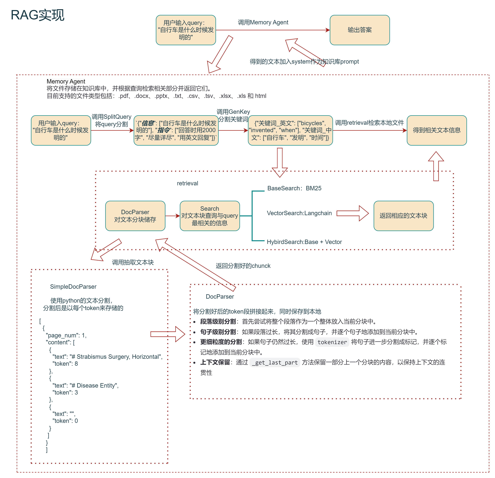

# Qwen-Agent 框架解析
## RAG实现
整理了该代码框架下的RAG实现

    

## Search模块
### 基于BM25
1. 抽取用户问题中的相关关键字
2. 使用BM25计算关键词与分块文档的相关性，找出相关性Top-k个相关快
3. 返回Top-K个相关块文档文本

### 向量搜索
1. 将用户query和文档内容向量化
2. 计算两者的余弦相似度
3. 返回Top-K个相关块文档文本

### 混合搜索
1. 分别使用BM25和向量检索返回文本块的相关分数
2. 使用倒数排名融合 (RRF) 等算法进行得分排名融合
3. 返回Top-K个得分最高的文本块

### 改进
在文本分块的时候可以先调用LLM为每个文本块做一段上下文总结,使每个文本中包含上下文信息

## 调用工具设计
1. 确定工具输入参数，规定工具输入数据格式
2. 现在的新模型中都支持工具调用，可以让模型自行选择工具调用，也可以自己设计
prompt对用户query进行分析和抽取关键元素
3. 根据具体的需求设计工具执行内容，可以让工具查外部数据库等

## Agent推理
在模型回答多跳推理问题时，可以构建多智能体如ReAct、Reflexion等来改善

